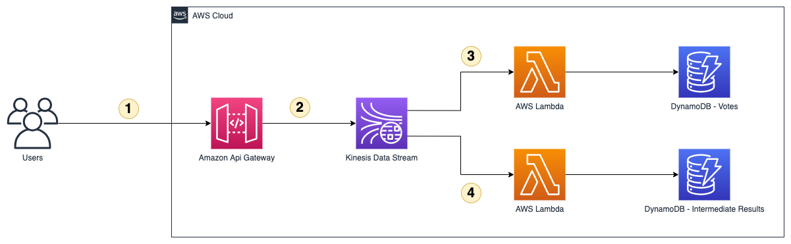
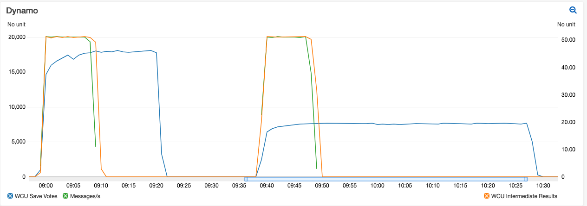
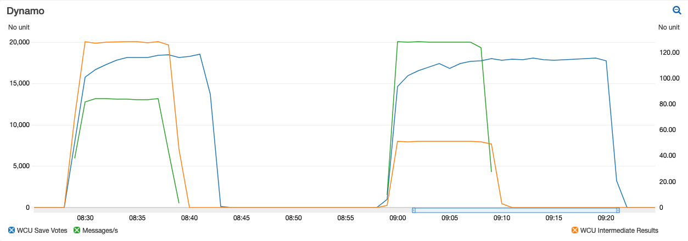

# High traffic Voting Backend
This sample can be used as a baseline implementing Systems that can handle hundreds of thousand and even Millions of Requests/Vots per Second.
The Spike will be absorbed and all Votes are written to a DynamoDB database. This can take longer than the vote is available. 
So the System offers also intermediate Results in near Realtime. 

## Architecture Diagram

1) The User sending their vote via Rest-API to Amazon API Gateway
2) Amazon API Gateway writes all incoming votes directly to an Amazon Kinesis Data stream. This stream is divided into Shards and every Shard 
can ingest 1000 records or 1MiB of Data per second. Because the vote object is small in size the records limit applies. That means you have to 
provision enough Shards for the expected peak Load.
3) A Lambda Function then writes all the incoming votes to a DynamoDB Table. The Lambda Function ensures that only one vote per User and option 
is saved in the Database. Only the last submitted option is persisted. Older values will be overwritten with the least vote value. The required 
Write Capacity Units (WCU) can be controlled first by the parallelization factor of the consumer and second by the batch size. With this it is 
possible to balance between fast delivery of the final results and the costs for the required Write Capacity Units.
4) Depending on the configuration in 3) it can take much longer to get the final voting results because every vote has do be processed 
before the final results can be calculated. The second Lambda function has a much higher batch Size and accumulates the votes internally and only
updates the count for every option. Multiple votes will not be filtered out but with this, it is possible to have intermediate results as soon 
as the votes flying into the system.
   
## Impact of batch size and batch window to Database load


The graph shows two scenarios with 20k Messages/second over a 10 Minute Timeframe (green line). With a batch size of 25 the peak WCU usage was around 18k.
With 10 as batch size the system uses only half the WCU's but also took as twice the time.  
The orange line shows the used WCU for the intermediate results table. Because the functions accumulates the results before writing it to the database 
the function need only a fraction of the WCU's and finished the work only a few seconds after the last votes coming in.



This graph shows the impact of the batch window for the intermediate results function. The function uses the max allowed batch size of 10k elements.
After watching the logs, with 20k Messages/Second the batch had a size of under 1k messages per Lambda invocation which results in more writes to the 
database. On the left side the batch window was set to 2 seconds and on the right side to 5 seconds. This reduced the required writes by 3 with no 
meaningfull impact on the speed handling all votes.

## Deployment with CDK
```bash
cdk bootstrap
cdk deploy
```

## FAQs
### Q: How can I contribute?

See the [Contributing Guidelines](CONTRIBUTING.md) for details.

## License

This library is licensed under the MIT-0 License. See the [LICENSE](LICENSE) file.